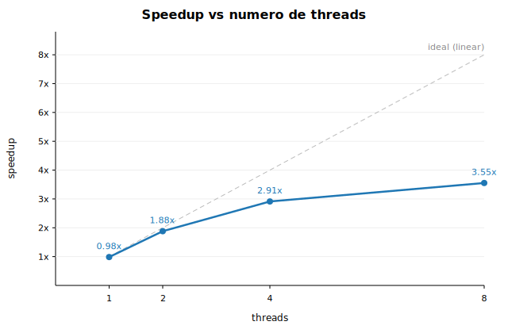

# Trabalho Prático 1 — LPII 2026.1 — P2: Merge Sort Paralelo

| Campo | Valor |
|---|---|
| **Nome** | Maria Clara Dantas Torres |
| **Matrícula** | 20240008083 |
| **Disciplina** | Linguagens de Programação II — UFPB |
| **Problema** | P2 — Merge sort de arquivo grande |
| **Linguagem** | C (C11) + POSIX threads (pthreads) |

---

## Descrição do problema

Lê N inteiros de um arquivo binário para um vetor e os ordena em ordem
não-decrescente usando merge sort. A versão sequencial usa uma única thread; a
versão paralela divide o vetor em T segmentos contíguos, cada thread ordena o seu
segmento com merge sort, e a thread principal mescla os T segmentos ordenados em
árvore (merges 2 a 2). A âncora de corretude é a igualdade exata com o resultado
da versão sequencial.

---

## Estratégia de paralelização

1. O vetor com os `N` inteiros é dividido em `T` segmentos contíguos
   (`T` = número de threads), com o resto distribuído entre os primeiros segmentos.
2. **Fase 1 (paralela):** cada thread ordena o seu segmento com merge sort.
   Os segmentos são disjuntos, então cada thread escreve apenas na sua fatia do
   vetor e do buffer auxiliar — **não há condição de corrida** e nenhum lock é
   necessário.
3. **Fase 2 (mescla):** a thread principal mescla os `T` segmentos já ordenados,
   em árvore (mescla de pares adjacentes até sobrar um único intervalo ordenado).

---

## Estrutura do projeto

```
.
├── Makefile
├── README.md
├── src/
│   ├── merge_sort.h/.c      # merge sort sequencial (núcleo das duas versões)
│   ├── io_utils.h/.c        # leitura/escrita binária e verificação de ordenação
│   ├── timer.h              # relógio monotônico (cronometra só a computação)
│   ├── generate.c           # gera o arquivo de entrada
│   ├── sequential.c         # versão sequencial (Q2)
│   └── parallel.c           # versão paralela  (Q3/Q4)
├── scripts/
│   ├── run_benchmark.sh     # roda 6 execuções por config (1ª descartada) → CSV
│   └── plot_results.py      # gera tabela de escalabilidade e gráfico SVG
└── results/
    ├── benchmark.csv
    ├── summary.md
    └── speedup.svg
```

---

## Como compilar e executar

### Com Makefile (recomendado)

```bash
# Compilar tudo
make

# Gerar arquivo de entrada (10 milhões de inteiros por padrão)
make data
# para mudar o tamanho:  make data COUNT=5000000

# Versão sequencial
make run-seq
# ou:  ./bin/sequential data/input.bin

# Versão paralela (número de threads configurável)
make run-par THREADS=8
# ou:  ./bin/parallel data/input.bin 8
```

### Comando gcc único (ambiente sem CMake/Make)

```bash
gcc -O2 -Wall -Wextra -pthread src/merge_sort.c src/io_utils.c src/generate.c \
    -Isrc -o generate && ./generate data/input.bin 10000000

gcc -O2 -Wall -Wextra -pthread src/merge_sort.c src/io_utils.c src/sequential.c \
    -Isrc -o sequential && ./sequential data/input.bin

gcc -O2 -Wall -Wextra -pthread src/merge_sort.c src/io_utils.c src/parallel.c \
    -Isrc -o parallel && ./parallel data/input.bin 4
```

O **número de threads é configurável por argumento de linha de comando**:
`./parallel <arquivo_entrada> <num_threads>`.

### Benchmark completo (Q2/Q3/Q4)

```bash
make bench                          # 6 execuções por config; 1ª descartada
python3 scripts/plot_results.py     # gera results/summary.md e results/speedup.svg
```

---

## Geração dos dados de entrada

O enunciado orienta usar o [random.org/integers](https://random.org/integers) como
fonte ou usar um número do random.org como semente de um gerador local. Por conta
do limite de ~10.000 números por requisição do random.org, foi adotada a segunda
abordagem: o programa `generate.c` usa `srand(42)` como semente fixa e combina
dois `rand()` por inteiro (`(rand() << 16) ^ rand()`) para cobrir toda a faixa de
`int`. A semente 42 é arbitrária e documentada; o arquivo gerado é **reproduzível**
em qualquer máquina com a mesma semente.

```bash
./bin/generate data/input.bin 10000000 42   # 10M inteiros, semente 42
```

---

## Ambiente de teste

| Item | Detalhe |
|---|---|
| **CPU** | Apple M4 |
| **Núcleos físicos** | 10 |
| **Núcleos lógicos** | 10 |
| **Sistema Operacional** | macOS 26.5.1 |
| **Compilador** | Apple clang 21.0.0 |
| **Flags de compilação** | `-O2 -Wall -Wextra -std=c11 -pthread` |
| **Tamanho da entrada** | 10.000.000 inteiros (≈ 38 MB) |

---

## Metodologia de medição

- **Cronometra-se apenas a computação** (ordenação + mescla final na versão
  paralela). Leitura do arquivo e alocação de memória ficam **fora do timer**.
  Usa-se `clock_gettime(CLOCK_MONOTONIC)`.
- Cada configuração é executada **6 vezes**; a **primeira é descartada**
  (aquecimento de cache/TLB); reporta-se a **média das 5 restantes**.
- Entre execuções, cada chamada ao binário relê o arquivo do disco, garantindo
  que o vetor está sempre desordenado no início da cronometragem.
- **Verificação automática de corretude:** a versão paralela copia o vetor
  original, ordena a cópia com o merge sort sequencial e compara (`memcmp`)
  byte a byte com o resultado paralelo. Saída: `verificacao=OK` se idênticos,
  `verificacao=FALHOU` caso contrário.

Exemplo de saída:

```
modo=sequencial n=10000000 tempo=0.217595 s ordenado=SIM
modo=paralelo threads=8 n=10000000 tempo=0.061501 s ordenado=SIM verificacao=OK
```

---

## Resultados (Q2 / Q3 / Q4)

**Baseline sequencial (T_seq, Q2): 0,2177 s** *(média de 5 execuções válidas)*

### Tabela de escalabilidade (Q4)

| Threads | Tempo médio (s) | Desvio (s) | Speedup | Eficiência |
|--------:|----------------:|-----------:|--------:|-----------:|
| 1 | 0,2211 | 0,0049 | 0,98x | 98% |
| 2 | 0,1157 | 0,0005 | 1,88x | 94% |
| 4 | 0,0748 | 0,0003 | 2,91x | 73% |
| 8 | 0,0613 | 0,0007 | 3,55x | 44% |

> Speedup = T_seq / T_par; eficiência = speedup / num_threads.

### Gráfico de speedup



---

## Discussão (Q4)

- **Ganho real e claro:** de 1 para 8 threads o tempo cai de ~0,22 s para ~0,06 s,
  um speedup de **3,55×**. Com 1 thread, a versão paralela fica virtualmente igual
  à sequencial (0,98×), confirmando que o overhead de criação de threads é
  desprezível para esse tamanho de entrada.
- **A eficiência cai conforme aumentam as threads** (94% → 73% → 44%). Isso se
  deve a dois fatores principais:
  1. **Mescla final sequencial (Lei de Amdahl):** após as threads ordenarem seus
     pedaços, a junção dos T segmentos é executada pela thread principal. Essa
     parte serial não acelera com mais threads e passa a dominar o tempo total
     conforme a fase paralela fica mais rápida.
  2. **Limite de banda de memória:** merge sort é *memory-bound* — cada passo copia
     dados entre o vetor e o buffer auxiliar. Com mais threads disputando o mesmo
     barramento de memória, o ganho marginal decresce, mesmo havendo núcleos
     disponíveis.
- **Como melhorar:** paralelizar também a fase de mescla (árvore de merges com
  threads) reduziria a fração serial e aumentaria a eficiência em contagens altas
  de threads.

---

## Mapeamento das questões

| Questão | Onde está |
|---|---|
| Q1 — Repositório + build + README | este `README.md`, `Makefile` |
| Q2 — Sequencial cronometrado (≥5 execuções válidas) | `src/sequential.c`, `scripts/run_benchmark.sh`, `results/` |
| Q3 — Paralelo pthreads, corretude e speedup | `src/parallel.c` (verificação `memcmp` automática), tabela acima |
| Q4 — Escalabilidade 1/2/4/8, gráfico e discussão | `results/summary.md`, `results/speedup.svg`, seção *Discussão* |

---

## Convenções de código

- Número de threads nunca fixo: sempre passado como argumento de linha de comando.
